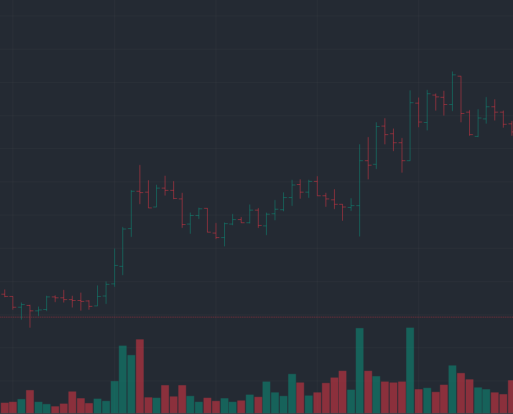
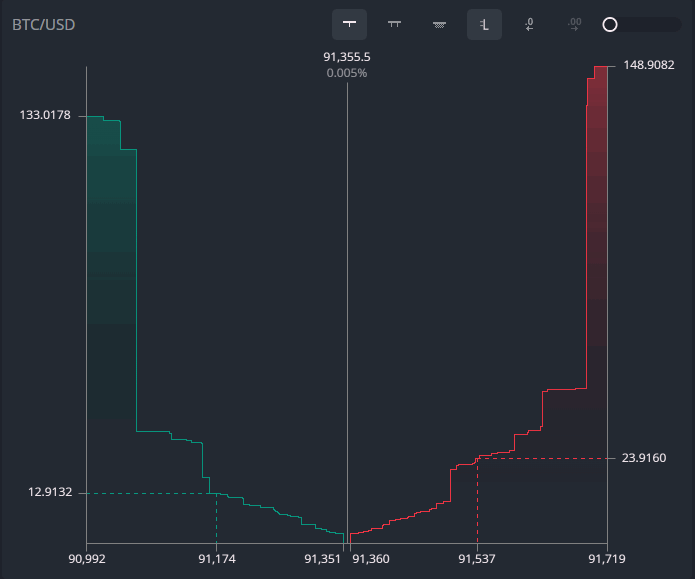

# Krypton — Real-Time Crypto Trading Dashboard

Krypton is a high-performance, real-time crypto trading dashboard inspired by TradingView-style platforms. The project focuses on building low-latency, data-intensive user interfaces by combining **reactive programming**, **custom chart rendering**, and a performance-oriented front-end architecture.

  
    
  

The application is built with **React**, **RxJS**, **D3.js**, **HTML5 Canvas**, and **Webpack**, and is designed to explore how modern front-end systems can handle high-frequency financial data while remaining responsive and visually precise.

🌐 Live Demo: https://krypton-navy.vercel.app/

---

## Project Overview

Krypton is a real-time crypto trading dashboard inspired by TradingView, built to explore reactive data flows and high-performance chart rendering. Live market data is modeled with RxJS observables, allowing complex updates to be composed and synchronized before reaching the UI.

D3.js handles interactions such as zooming, panning, and scaling across time and price axes, while the charts are rendered on HTML5 Canvas to efficiently display large datasets. Lazy rendering and level-of-detail techniques are used to keep the interface responsive under high-frequency updates.

The project emphasizes a data-first, performance-aware architecture with a clear separation between data processing and presentation, suitable for building low-latency, visualization-heavy applications.

